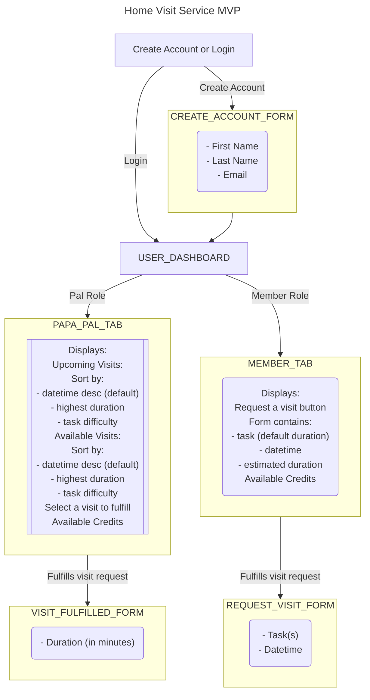

# PapaChallenge

Home Visit Service MVP Flowchart

Post MVP Roadmap:

* do not allow Pals to select visits that overlap with another visit based on estimated duration and datetime
* password requirements
* forgot password
* 2FA / OTP
* RBAC
* more granular email validation
* admin dashboard to show metrics
  * visits this month
  * revenue to date
  * users
    * pals
    * members
  * top tasks
  * upcoming scheduled visits
  * most recently completed visits
* allow users to edit name and email
* allow users to upload avatar images
* require users to upload drivers license and selfie

  
To start this application:

  * Run `mix setup` to install and setup dependencies
  * Start Phoenix endpoint with `mix phx.server` or inside IEx with `iex -S mix phx.server`

Now you can visit [`localhost:4000`](http://localhost:4000) from your browser.

Available APIs:

* /user
  * GET /user/<user_id>
  * GET /user/<user_id>/transactions
  * GET /user/<user_id>/visits
  * POST /user
  * POST /user/<user_id>
* /visit
  * GET  /visit/<visit_id>
  * POST /visit
  * POST /visit/<visit_id>
* /transaction
  * GET  /transaction/<transaction_id>
  * POST /transaction
  * POST /transaction/<transaction_id>
