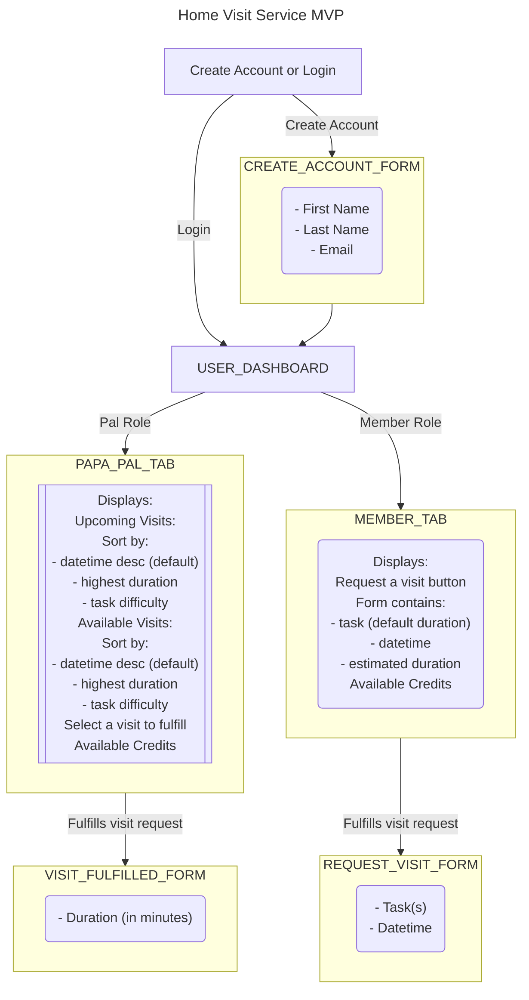

# PapaChallenge

# Instructions

* It is assumed that a PostgreSQL instance is already running locally
* Run `mix setup` to install and setup dependencies
* Start Phoenix endpoint with `mix phx.server` or inside IEx with `iex -S mix phx.server`

Now you can visit [`localhost:4000`](http://localhost:4000) from your browser.

First a new user must `Register` before logging into the application. The seeded users all use the same password, `passwordtest`. The seeded user emails are `pal@test.com` `member@test.com` and `memberpal@test.com`

New members are give a balance with 60 minutes to use, which can be seen in the top right of the page.

Once you hit the landing page you can click on either the `Visit` button that will take you to a list of all visits or the `Request a Visit` button that will take you to the Visit Request Form.

The `/visits` page lists all visits, past and present. A user can interact with only unfulfilled visits. Only the creator/owner of the visit may `Edit` a visit, otherwise the only other action available is to `Fulfill` the visit.

When a user fulfills a visit request the service will go ahead and set the `end_datetime` as the current UTC datetime and update the Visit status to `fulfilled`.

The system will also deduct the specified number of minutes from the balance of the member that requested the visit, the overhead fee is then deducted from those minutes (15%) and the remainder is added to the balance of the Pal that fulfilled the visit request.

When a user edits a visit request they can only edit the `tasks`, `start_datetime`, and `minutes` to complete the visit.

## Post MVP Roadmap

* do not allow Pals to select visits that overlap with another visit based on estimated duration and datetime
* 2FA / OTP
* RBAC
* admin dashboard to show metrics
  * visits this month
  * revenue to date
  * users
    * pals
    * members
  * top tasks
  * upcoming scheduled visits
  * most recently completed visits
* allow users to upload avatar images
* require users to upload drivers license and selfie
* add address to visit requests
  * add destination address for visits that require travel
  * add directions via Google Maps or MapBox API
* allow a Member to add more minutes via Health Plan or payment methods

## Initial Home Visit Service MVP Flowchart

